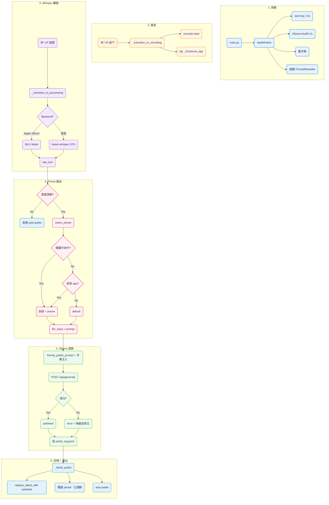

# Whisper Pro · 應用程式運作流程

> 技術導向說明：從按下熱鍵到文字出現的每一個環節。
> 適用版本：v2.1（`feat/phase1-ollama-polish`）
> 最後更新：2026-04-22

---

## 0 · 文件導讀

本文有三層：

1. **全景流程圖**（mermaid + ASCII 各一份）—— 30 秒看懂系統
2. **六大階段深度解析** —— 每個階段的技術細節
3. **關鍵子系統拆解** —— Ollama 潤飾、preset 路由、字典注入、熱重載各自獨立說明

---

## 1 · 全景流程圖

### ASCII 版（終端機可讀）

```
  ┌───────────────────────────────────────────────────────────┐
  │              階段 1 · 啟動與暖身                             │
  │                                                            │
  │  main.py ── 依賴檢查 ── Config.load ── AppWindow 建構         │
  │                                          │                 │
  │                                          ├─► warmup (1.5s) │
  │                                          ├─► Ollama health │
  │                                          │    check (2s)   │
  │                                          ├─► 載字典        │
  │                                          └─► 啟動 Prompt   │
  │                                               reloader     │
  └───────────────────────────────────────────────────────────┘
                               │
                               ▼  (等待熱鍵 / 按鈕)
  ┌───────────────────────────────────────────────────────────┐
  │              階段 2 · 觸發與錄音                             │
  │                                                            │
  │  ⌘⌥R 按下                                                   │
  │   │                                                        │
  │   ├─► _transition_to_recording()                          │
  │   │    ├─► recorder.start() (sounddevice InputStream)      │
  │   │    └─► 背景執行緒抓 _frontmost_app (osascript)          │
  │   │                                                        │
  │   ▼                                                        │
  │  chamber 進入 RECORDING (紅色脈衝、RMS 驅動漣漪)             │
  └───────────────────────────────────────────────────────────┘
                               │
                               ▼  (⌘⌥R 放開)
  ┌───────────────────────────────────────────────────────────┐
  │              階段 3 · 轉錄 (Whisper)                         │
  │                                                            │
  │  _transition_to_processing()                               │
  │   ├─► recorder.stop() → float32 numpy                      │
  │   ├─► chamber 進入 PROCESSING (琥珀色 + 12 顆粒子旋轉)        │
  │   └─► 背景執行緒跑 transcriber.transcribe(audio)              │
  │                                                            │
  │         Backend 自動選：                                    │
  │         • Apple Silicon → mlx_whisper (Metal GPU)           │
  │         • 其他          → faster-whisper (CPU int8)          │
  │                                                            │
  │         注入 initial_prompt：                                │
  │         基礎提示 + 個人字典前 30 個詞                        │
  │                                                            │
  │         ⚠ 幻覺過濾：match _HALLUCINATIONS 清單就丟掉         │
  │         ⚠ 靜音守門：RMS < 0.002 直接回「未偵測到語音」        │
  └───────────────────────────────────────────────────────────┘
                               │
                               ▼  raw_text
  ┌───────────────────────────────────────────────────────────┐
  │              階段 4 · 潤飾路由 (Phase 2 新)                  │
  │                                                            │
  │   _on_transcription_done(result)                           │
  │    │                                                       │
  │    ├─ 決定走哪條路：                                         │
  │    │    valid AND cfg.ollama_enabled AND health_ok is True │
  │    │     │          │                                      │
  │    │  Yes           No                                     │
  │    │     ▼            ▼                                    │
  │    │  潤飾路徑    直接 auto-paste 原文                       │
  │    │                                                       │
  │    ▼ 潤飾路徑:                                              │
  │    _start_polish(gen, raw_text, target)                    │
  │        │                                                   │
  │        ▼                                                   │
  │    presets.select_preset(raw_text, _frontmost_app)         │
  │        │                                                   │
  │        ├─► 1. 關鍵字前綴？(「寄信給 」/ 「email to 」...)      │
  │        │      └─ 命中 → 剝除 + 切 preset                    │
  │        │                                                   │
  │        ├─► 2. 前景 app 對應？(Mail→email, Slack→chat…)       │
  │        │      └─ 命中 → 切 preset                           │
  │        │                                                   │
  │        └─► 3. 都沒命中 → default                            │
  │                                                            │
  │        結果 = PresetSelection(preset, text, matched_reason)│
  └───────────────────────────────────────────────────────────┘
                               │
                               ▼  llm_input + preset.prompt
  ┌───────────────────────────────────────────────────────────┐
  │              階段 5 · 潤飾 (Ollama)                          │
  │                                                            │
  │   OllamaClient.process(                                    │
  │      text=llm_input,                                       │
  │      prompt_template=preset.resolve_prompt(),  ← lazy 查詢  │
  │      dictionary_terms=[...],                               │
  │      preset_name="email",                                  │
  │   )                                                        │
  │    │                                                       │
  │    ├─► prompts.format_polish_prompt() 把字典約束注入 prompt │
  │    ├─► POST http://localhost:11434/api/generate            │
  │    │      ├─ 超時 → error="潤飾超時"                        │
  │    │      ├─ 連線失敗 → error="無法連線 Ollama 服務"         │
  │    │      └─ 空回應 → error="Ollama 回傳空字串"              │
  │    ├─► _strip_wrapper_quotes 去外層引號                     │
  │    ├─► 無論成功失敗，寫一行 JSONL 到 polish_log.jsonl        │
  │    └─► 回 OllamaResponse（失敗時 .text 回原文 = 降級）       │
  └───────────────────────────────────────────────────────────┘
                               │
                               ▼  polished (或原文降級)
  ┌───────────────────────────────────────────────────────────┐
  │              階段 6 · 回填 + 自動貼上                         │
  │                                                            │
  │   _finish_polish(gen, raw_text, target, resp)              │
  │    │                                                       │
  │    ├─► 世代號檢查：gen != _polish_generation 就丟棄         │
  │    │                                                       │
  │    ├─ 成功:                                                 │
  │    │   ├─► _last_polished = polished                       │
  │    │   ├─► _replace_latest_with(polished, raw_text)        │
  │    │   │     (tk marks latest_start/end 精準替換)           │
  │    │   ├─► 標題：preset · 已潤飾 · 1.2s                     │
  │    │   ├─► toggle chip 兩顆點亮                             │
  │    │   └─► auto-paste polished（若 target 存在）             │
  │    │                                                       │
  │    └─ 失敗（error 欄位非 None）:                             │
  │        ├─► 標題：preset · 原文（潤飾失敗）                   │
  │        └─► auto-paste raw_text（降級）                      │
  └───────────────────────────────────────────────────────────┘
                               │
                               ▼  (回到階段 2 等待下次觸發)
```

### Mermaid 版（視覺化工具可呈現）



---

## 2 · 六大階段深度解析

### 階段 1 · 啟動與暖身

**入口**：`main.py` 執行 log 重定向、faulthandler 啟用（捕捉 SIGSEGV/SIGABRT 到 `fault.log`）、依賴檢查、`Config.load()`。

**UI 建構**：`AppWindow.__init__` 建全部元件。這一階段**必須在 5 秒內完成**，否則使用者第一印象差。關鍵：**不在建構期間做任何同步網路 I/O**。

**三個背景初始化**：
| 啟動延遲 | 動作 | 為何延後 |
|---|---|---|
| 0 ms | 載入個人字典 | 純檔案 I/O、~5 ms |
| 1500 ms | `self.after(1500, self._warmup_model)` | Whisper 模型預熱、2-5 秒、背景執行緒 |
| 2000 ms | `self.after(2000, self._refresh_ollama_health)` | Ollama HTTP probe、1.5 秒 timeout、背景執行緒 |
| 2000 ms | `PromptReloader.start()` | 啟動 mtime 輪詢 daemon thread |

**為何 health check 延到 2 秒後**：Ollama 離線時 probe 會等 1.5 秒 timeout，如果放同步、放啟動流程，UI 會卡住。

### 階段 2 · 觸發與錄音

兩種觸發方式**同路徑**：

```
  按鈕點擊        全域熱鍵按下
        │               │
        └───────┬───────┘
                ▼
        _transition_to_recording()
```

**狀態檢查**：`if self._state != "idle": return` —— 防止在「錄音中」或「處理中」狀態重新進入。

**前景 app 捕捉**（A1 修法後）：
```
self._paste_target  = None       ← ⌘V 目標
self._frontmost_app = None       ← preset 路由用

background thread:
    app = osascript("tell application ...")  # 最多 2s timeout
    if _state == "recording":
        _frontmost_app = app                       # 永遠設
        if cfg.auto_paste:
            _paste_target = app                    # 只在 auto_paste 開時設
```

**背景執行緒重要**：osascript 逾時會慢 2 秒，若同步跑會卡住 `recorder.start()` 呼叫。

**錄音本身**：`sounddevice.InputStream` 開 16 kHz mono float32，100 ms callback 送資料進 `_frames: list[np.ndarray]`，同時更新 `_rms_level`（給 chamber 動畫）。

### 階段 3 · 轉錄（Whisper）

放開熱鍵 → `_transition_to_processing()` → `recorder.stop()` → 整段 float32 numpy → 背景執行緒 `_run_transcription`。

**後端自動選擇**（`transcriber.py:_detect_backend()`）：
```
if platform.machine() == "arm64":
    try:
        import mlx_whisper
        return "mlx"        # Apple Silicon 首選，Metal GPU
    except ImportError:
        pass
return "ctranslate"         # faster-whisper CPU int8
```

**initial_prompt 組合**（v2.1 字典注入）：
```python
def _build_initial_prompt(self) -> str:
    return prompts.format_whisper_prompt(self._dictionary_terms)
```

產出：
```
這是一段繁體中文與英文夾雜的對話。請使用正體中文（繁體中文），
原文保留英文單字與專有名詞，不要翻譯，保持口語自然。
常用詞彙：cyberpunk、Kubernetes、Jerry Chen。
```

**兩個守門**：
1. **靜音守門**（`_is_silence`）：RMS < 0.002 直接回「（未偵測到語音內容）」，不呼叫 Whisper。
2. **幻覺過濾**（`_is_hallucination`）：輸出匹配 `_HALLUCINATIONS`（「作詞」「李宗盛」「請訂閱」「please subscribe」等 14 條）→ 覆蓋為「（未偵測到語音內容）」。

完成後 `self.after(0, self._on_transcription_done, result)` 切回主執行緒。

### 階段 4 · 潤飾路由（Phase 2）

**決策**：
```python
take_polish_path = (
    valid                            # 有內容且不是幻覺
    and self.cfg.ollama_enabled      # 設定啟用
    and self.ollama.health_ok is True  # 探測過且 OK
)
```

`health_ok is True` 嚴格比較（不是 `is not False`）—— 啟動 2 秒內 `health_ok=None`，不走潤飾路徑，貼原文。保守設計。

**走潤飾**：`_start_polish(gen, raw_text, target)`。

`gen = self._polish_generation`（每次新轉錄 +1），用來在 `_finish_polish` 判斷此結果是否已過期。

**路由**：
```python
selection = _presets.select_preset(
    raw_text,
    self._frontmost_app,            # A1 修法後用 _frontmost_app
    enabled=self.cfg.preset_overrides,
)
```

路由規則（`presets.py:select_preset`）：

```
1. 遍歷非 default preset，檢查 triggers_keyword：
     if text.lstrip() 以 keyword 開頭 AND 後接邊界字元（空白/,/,/:）:
         命中 → 剝除 keyword + 邊界字元，回 PresetSelection

2. 若 keyword 沒命中，遍歷非 default preset 檢查 triggers_app：
     lowercase(app_name) 去掉 ".app" 後比對 triggers_app set
         命中 → 回 PresetSelection（text 原樣）

3. 都沒命中 → default preset（text 原樣）

任何例外 → default preset（保險降級）
```

**結果**：
```python
PresetSelection(
    preset=Preset(...),                  # email / chat / note / code_comment / default
    text="實際送 LLM 的內容（可能剝除關鍵字）",
    matched_reason="keyword:寄信給" | "app:mail" | "default",
)
```

### 階段 5 · 潤飾（Ollama）

**呼叫點**：
```python
resp = self.ollama.process(
    llm_input,
    prompt_template=preset.resolve_prompt(),
    dictionary_terms=dict_terms,
    preset_name=preset_name,
)
```

**`preset.resolve_prompt()`** 是 lazy lookup：
```python
def resolve_prompt(self) -> str:
    return getattr(prompts, self.prompt_attr, prompts.OLLAMA_POLISH_PROMPT)
```
每次呼叫**動態查 `prompts` 模組**，這是熱重載能運作的關鍵。

**字典注入**（`prompts.format_polish_prompt`）：找到 prompt 中的 `原文：\n{text}` 標記，在它前面插入：
```
★ 務必逐字保留下列術語原文，不要替換為同音字或翻譯：cyberpunk、Kubernetes、Jerry Chen

原文：
{text}
```

**HTTP 請求**：
```python
POST http://localhost:11434/api/generate
{
  "model": "qwen2.5:3b-instruct",
  "prompt": "<完整 prompt with {text} replaced>",
  "stream": false,
  "options": {
    "temperature": 0.2,    # 潤飾不要創意
    "top_p":       0.9,
    "num_predict": 1024,   # 避免 LLM 失控暴走
  }
}
```

**錯誤降級（鐵則）**：任何錯誤都回 `OllamaResponse(text=原輸入, error="描述")`。呼叫端永遠可以無腦用 `.text`，不需判斷是否成功。

**Polish log**（成功失敗都寫）：
```json
{"ts":"2026-04-22T12:05:19","model":"qwen2.5:3b-instruct","preset":"email","elapsed_s":3.375,"len_in":44,"len_out":49,"error":null}
```

**外層引號修剪**：LLM 有時會把整段包成 `"..."` 或 `「...」`，`_strip_wrapper_quotes` 只在首尾**同時**是引號**且中間沒有該引號**時才剝掉。

### 階段 6 · 回填 + 自動貼上

`_finish_polish` **在主執行緒**（`self.after(0, ...)` 切回）：

**世代號檢查**：
```python
if gen != self._polish_generation:
    return          # 已有新錄音，丟棄此結果
```

**成功路徑**：
```
_last_polished = polished
_replace_latest_with(polished, expect_current=raw_text)
                              │
                              ▼
                    tk marks latest_start/end
                    比對 textbox 該段目前內容
                    若不等於 raw_text（使用者手動編輯過）→ 放棄
                    若等於 → delete + insert polished
```

**標題重建**（C2 修法後）：
```python
self._title_status = f"已潤飾 · {elapsed:.1f}s"
self._rebuild_result_title()
# 產出: 轉錄結果  (15s · ZH · large-v3-turbo)  · Email · 已潤飾 · 1.2s
```

**自動貼上**（策略 B）：
```python
if target:
    threading.Thread(
        target=self._do_auto_paste,
        args=(paste_text, target),     # 成功時 paste polished，失敗時 paste raw
        daemon=True,
    ).start()
```

`_do_auto_paste` 跑在背景執行緒：
```
1. pyperclip.copy(text)
2. osascript tell application {target} to activate
3. time.sleep(0.18)   # 讓 app 回到前景
4. pynput Controller().pressed(cmd).tap("v")
```

---

## 3 · 關鍵子系統

### 3.1 · Ollama 潤飾客戶端架構

```
  ┌─────────────────────────────────────────────┐
  │          OllamaClient                        │
  │                                              │
  │  ┌────────────────────────────────────────┐ │
  │  │  config: OllamaConfig                  │ │
  │  │    base_url / model / enabled /        │ │
  │  │    timeout / log_enabled               │ │
  │  └────────────────────────────────────────┘ │
  │                                              │
  │  ┌────────────────────────────────────────┐ │
  │  │  apply_app_config(cfg)                 │ │
  │  │  同步 App Config 欄位到 OllamaConfig   │ │
  │  └────────────────────────────────────────┘ │
  │                                              │
  │  ┌────────────────────────────────────────┐ │
  │  │  health_check_sync (1.5s timeout)      │ │
  │  │  health_check_async (thread)           │ │
  │  │  health_ok: Optional[bool] (快取)      │ │
  │  └────────────────────────────────────────┘ │
  │                                              │
  │  ┌────────────────────────────────────────┐ │
  │  │  process(text, prompt_template,        │ │
  │  │          dictionary_terms, preset_name)│ │
  │  │                                        │ │
  │  │  所有失敗路徑 → OllamaResponse(        │ │
  │  │    text=原輸入, error=描述)            │ │
  │  └────────────────────────────────────────┘ │
  └─────────────────────────────────────────────┘
```

### 3.2 · Preset 路由決策樹

```
  輸入: (text, app_name, enabled_overrides)
  │
  ├─► for p in PRESETS values, p.name != "default":
  │     if not enabled.get(p.name, True): 跳過
  │     hit = _match_keyword(text, p.triggers_keyword)
  │     if hit:
  │         return PresetSelection(p, stripped_text, "keyword:..")
  │
  ├─► app = normalize(app_name)  # lowercase, strip .app
  │   if app:
  │     for p in PRESETS values, p.name != "default":
  │       if not enabled.get(p.name, True): 跳過
  │       if app in p.triggers_app:
  │         return PresetSelection(p, text, f"app:{app}")
  │
  └─► return PresetSelection(default, text, "default")
```

`_match_keyword` 的**邊界規則**：

```python
_KW_BOUNDARY = re.compile(r"[\s,，:：。、!！?？]")

text.lstrip().lower().startswith(kw)   # 開頭錨
AND
(後面是結尾  OR  _KW_BOUNDARY.match(next_char))
```

這讓「寄信給Jerry」（無空格）不誤觸發，只有「寄信給 Jerry」或「寄信給, Jerry」才命中。

### 3.3 · 字典注入 Pipeline

```
  ~/.whisper_app/dictionary.json
          │
          ▼
  dictionary.load_terms()
          │  dedup (lowercase key)、保序、filter empty
          ▼
  ["Whisper Pro", "Ollama", ...]
          │
          ├──────────────────────┬──────────────────────┐
          ▼                      ▼                      ▼
  Transcriber.set_             ollama_client.process     (preset UI)
  dictionary_terms()            (dictionary_terms=...)
          │                      │
          ▼                      ▼
  _build_initial_prompt()    format_polish_prompt()
          │                      │
          ▼                      ▼
  "常用詞彙：Whisper Pro、    "★ 務必逐字保留下列術語...\n\n原文：\n{text}"
   Ollama。" (前 30 個)       (前 50 個)
          │                      │
          ▼                      ▼
    Whisper transcribe         Ollama /api/generate
```

### 3.4 · Prompt 熱重載（mtime 輪詢）

```
  PromptReloader 背景 thread 每 2 秒輪詢:
  │
  ├─► for name in ("prompts", "presets"):
  │     path = Path(mod.__file__)
  │     mtime = path.stat().st_mtime
  │     if mtime > previous_mtime + 0.001:
  │         importlib.reload(mod)
  │         callback(name)       # gui.py 彈 toast
  │
  └─► _stop.wait(2.0) 在兩輪之間，supports graceful shutdown
```

**為何用輪詢而非 watchdog**：純 stdlib、無新依賴、CPU 近 0（4 次 stat() / 2s）。

**為何 `prompts.py` 能被熱重載**：
1. 所有 prompt 是 module-level string（不是 function return value）
2. 呼叫端 **一律**用 `prompts.OLLAMA_POLISH_PROMPT` 動態查詢（不用 `from prompts import ...`）
3. `importlib.reload` 重跑 module 程式碼，更新 module namespace 的屬性
4. 動態查詢在下一次呼叫時就拿到新值

`preset.resolve_prompt()` 內部 `getattr(prompts, self.prompt_attr)` 也走同一邏輯。

### 3.5 · 熱鍵擷取（重綁定對話框）

**舊版問題**（v2.0）：使用 pynput `Listener` 在背景執行緒擷取。macOS 26.4+ 對 `TSMGetInputSourceProperty` 的主執行緒斷言使 App SIGTRAP 閃退。

**v2.1 修法**：改用 Tk 原生 `<KeyPress>` / `<KeyRelease>` binding。

```
  對話框 __init__ → grab_set() + focus_force()
  │
  ├─► self.bind("<KeyPress>",   _on_tk_key_press)
  └─► self.bind("<KeyRelease>", _on_tk_key_release)

  _on_tk_key_press:
    name = _keysym_to_name(event.keysym)
    # "Meta_L" → "cmd"
    # "Alt_L"  → "alt"
    # "r"      → "r"
    # "F1"     → None（忽略）
    _current_keys.add(name)
    _max_combo = max(_current_keys, _max_combo)
    預覽顯示

  _on_tk_key_release:
    if not _captured AND max_combo 有非修飾鍵:
        _captured = combo_str(max_combo)
        啟用「確認套用」
        保持監聽（可重按）

  _on_tk_key_press 下一輪:
    if _captured AND current_keys 空:
        _reset_cycle()  # 自動重置讓使用者改意
```

**關鍵**：Tk 事件**在主執行緒**回調，完全不碰 TSM，macOS 斷言不觸發。

---

## 4 · 狀態機

```
                ┌─────────┐
                │  idle   │◄──────────┐
                └────┬────┘            │
                     │                 │
             (熱鍵按下 / 按鈕點擊)      │
                     ▼                 │
                ┌──────────┐           │
                │recording │           │
                └────┬─────┘           │
                     │                 │
              (熱鍵放開 / 按鈕點擊)    │
                     ▼                 │
                ┌────────────┐         │
                │ processing │─────────┘
                └────────────┘   (Whisper 完成)
```

**合法轉移只有這三條**。任何其他嘗試（例如「processing → recording」）會被 `_transition_*` 的開頭檢查擋掉。

**UI 反應**（Ambient Chamber）：

| 狀態 | 呼吸週期 | 主色 | 環數 | 中央圖示 |
|---|---|---|---|---|
| idle | 6.0 s | 青 #06B6D4 | 5 環漸淡 | mic |
| recording | 2.5 s | 紅 #EF4444 | 5 環 + RMS 漣漪 | square |
| processing | 1.6 s | 琥珀 #F59E0B | 4 環 + 12 粒子旋轉 | mic (dim) |

---

## 5 · 關鍵執行緒與同步

```
  主執行緒（Tk）
   │  - 所有 UI 操作
   │  - _on_transcription_done / _finish_polish / _apply_toggle_style
   │  - render tick (每 50 ms)
   │
   ├─── sounddevice callback thread
   │     - 把 audio chunk append 進 _frames (用 RLock)
   │     - 更新 _rms_level
   │
   ├─── Whisper transcribe thread (daemon)
   │     - mlx_whisper / faster-whisper 推論
   │     - 完成後 self.after(0, _on_transcription_done)
   │
   ├─── Ollama polish thread (daemon, 每次 _start_polish 開一個)
   │     - POST /api/generate
   │     - 完成後 self.after(0, _finish_polish)
   │
   ├─── Frontmost app capture thread (daemon, 每次錄音開始)
   │     - osascript
   │     - 完成後 self.after(0, _apply)
   │
   ├─── Ollama health check thread (daemon, 啟動 + 設定儲存後)
   │     - GET /api/tags
   │     - 完成後 self.after(0, _apply_polish_button_style)
   │
   ├─── Auto-paste thread (daemon)
   │     - pyperclip + osascript activate + pynput ⌘V
   │
   ├─── PromptReloader thread (daemon, App 生命週期)
   │     - 2 秒輪詢 mtime + importlib.reload
   │     - 觸發後 self.after(0, toast)
   │
   └─── pynput Hotkey listener thread (HotkeyManager)
         - 全域 ⌘⌥R 監聽
         - callback 透過 self.after(0, ...) 回主執行緒
```

**鐵則**：所有 UI 更新都必須在主執行緒。背景執行緒完成後一律 `self.after(0, callback)`。

---

## 6 · 錯誤處理分層

| 錯誤層 | 處理方式 |
|---|---|
| **Ollama 未啟動** | health check 回 False → 按鈕顯示「潤飾（離線）」+ 琥珀色；潤飾流程不走 polish path、直接用原文 |
| **Ollama 逾時（> 30s）** | `process()` 捕捉 `Timeout` → 回 `error="潤飾超時"` + `text=原輸入` → GUI 標題「原文（潤飾失敗）」+ toast + 貼原文 |
| **Ollama 回空字串** | raise → 捕捉 → 同上降級 |
| **Ollama 回傳異常 JSON** | raise → 捕捉 → 同上降級 |
| **Whisper 載入失敗** | raise `RuntimeError("無法載入 Whisper 模型")` → UI 狀態列「模型載入失敗」紅點 |
| **麥克風不可用** | `sounddevice` 回 error → log 到 app.log、`recorder.start()` 回 False、UI 狀態保持 idle |
| **輔助使用權限未開** | pynput import 失敗或 keyboard.tap 異常 → toast「自動貼上失敗（請確認輔助使用權限）」 |
| **字典 JSON 損毀** | `load_terms` 回 `[]`、print 警告、不拋例外 |
| **prompts.py 語法錯** | `importlib.reload` 失敗 → print 警告、保留舊值、使用者下次錄音仍用舊 prompt |
| **Python 層未捕捉例外** | `main.py` 頂層 try/except 印 stack trace 到 app.log |
| **C 層 crash（SIGSEGV / SIGABRT）** | `faulthandler` 寫到 fault.log，所有 threads |

**核心哲學**：**Ollama 任何問題都不能讓使用者沒結果**。原文永遠可用。

---

## 7 · 隱私與資源

- **所有資料本地**：錄音、轉錄、AI 潤飾、字典、log 都在你的 Mac 上
- **沒有網路請求**（除非你刻意用 http://remote-ollama:11434）
- **CPU 閒置**：idle 狀態只有 render tick（每 50 ms 畫 chamber）+ prompt_reloader（每 2 秒 stat）
- **記憶體**：Whisper large-v3-turbo 載入約 1 GB；Ollama 3B 載入約 2.5 GB；同時跑建議 16 GB+

---

## 8 · 版本歷程（運作流程視角）

| 版本 | 主要改動 |
|---|---|
| v1.0 | 基礎錄音 + Whisper + 自動貼上 |
| v2.0 | Ambient Chamber UI + 設計 token 系統 + Lucide 圖示 |
| **v2.1**（本版）| **Ollama 潤飾管線（策略 B）+ Phase 2 preset 路由 + 個人字典 + Prompt 熱重載 + 原文/潤飾 toggle + macOS 26.4 hotkey 修復** |

---

*版本：v2.1 ・ 最後更新：2026-04-22 ・ 對應分支：`feat/phase1-ollama-polish`*
