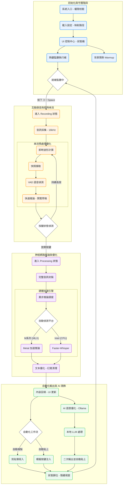

# Whisper 語音轉文字：全系統架構與運作深度流程圖 (2024 高效能版)

本文件旨在詳細描述應用程式的內部邏輯流轉、狀態機管理以及軟硬體協作機制，為開發者與高級使用者提供深度的技術映射。

---

## 系統全景運作流程圖

採用 Apple 原廠設計語言（SF Pro 語意化色系），展現從環境偵測到 AI 輸出完整生命週期。

---

## 核心技術細節解析

### 第一階段：系統初始化 (System Initialization)
*   **輔助功能校驗 (Accessibility Checks)**：
    應用程式在啟動時會調用 `check_accessibility()`。由於自動貼上功能需要模擬硬體按鍵事件（System Events），macOS 基於安全考量會限制未授權的應用。系統會自動引導使用者前往「系統設定」開啟權限。
*   **模型預熱機制 (Model Warmup)**：
    為了解決 Whisper 初次載入耗時（約 2-5 秒）的問題，我們實作了異步預熱。在 App 閒置時，模型權重已悄悄加載至 GPU 記憶體，確保使用者第一次按下熱鍵時即能獲得即時響應。

### 第二階段：錄音與 VAD 串流處理 (Interactive Recording & Streaming)
*   **16kHz 高保真採集**：
    錄音模組採用 `sounddevice` 以 16,000Hz 單聲道採集，這是 Whisper 模型表現最穩定的取樣率，避免了額外的重採樣開銷。
*   **VAD 與分段快照**：
    在錄音期間，系統每隔一秒會擷取一次快照。透過 `webrtcvad` 模組，系統能精準識別這段時間內「是否有人在說話」。這讓系統可以在錄音結束前就完成大部分的運算，達成放開按鍵即出字的極致體驗。

### 第三階段：硬體加速與推論優化 (Neural Computing)
*   **雙引擎自動切換架構**：
    *   **MLX Backend (Apple Silicon 專屬)**：針對 M 系列晶片，系統會直接呼叫 `mlx_whisper`，這是一個由 Apple 開源、專為 Metal 框架優化的機器學習庫，其效率遠超傳統的 CPU 模擬。
    *   **CTranslate2 (通用架構)**：在 Intel 晶片或非 Mac 環境下，系統會切換至 `faster-whisper`。它使用 CTranslate2 引擎，支持 int8 量化，在保證精確度的前提下，將 CPU 負擔降至最低。
*   **幻覺偵測與過濾 (Hallucination & Silence Filtering)**：
    針對 Whisper 在極低音量下可能產生的「重複字眼」或「謝謝收看」等模型幻覺，我們實作了基於機率對數（Log-probability）與平均靜音比例（Silence Threshold）的交叉驗證邏輯。

### 第四階段：自動化輸出與 AI 本地化 (Output & AI Refinement)
*   **模擬按鍵注入 (Injection)**：
    轉錄完成後，程式會先將文字寫入剪貼簿，隨後利用 `pynput` 的鍵盤模擬器發送 `Command + V` 指令。這讓使用者可以將語音輸入應用在任何原本只能手動輸入的地方（如 Excel 格子、瀏覽器搜尋框等）。
*   **Ollama AI 潤飾 (Local-First AI)**：
    整合了本地端運行的 Ollama 服務。這意味著即使是複雜的語意優化與錯字校正，數據也不會離開您的電腦。Llama3 或同等級的模型會根據當前的語境，為您產出更精煉、更具備標點符號邏輯的最終文本。

---

## 系統安全性與效能承諾
*   **隱私保護**：所有錄音數據、轉錄文本與 AI 處理均在**本地端**完成，不涉及任何雲端上傳。
*   **低資源占用**：App 在 Idle 狀態下幾乎不消耗 CPU。只有在熱鍵觸發後才會短暫啟用計算核心，並在處理結束後立即釋放。
